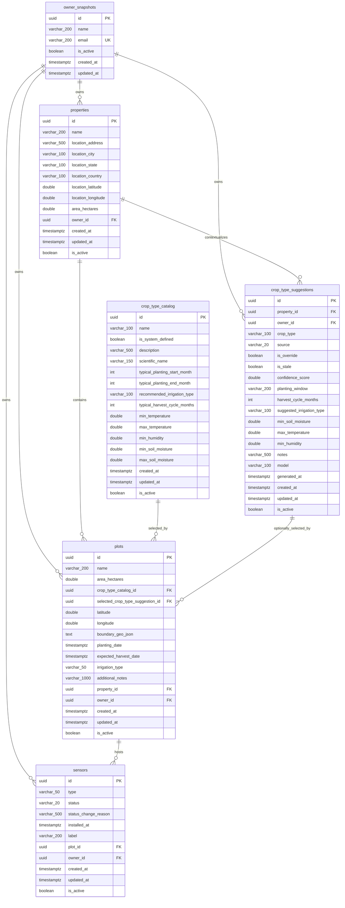

# Farm Service ER Diagram - Current Baseline

This document captures the baseline relational model introduced by `20260310205104_InitialMigration.cs` before the tenant-scoped catalog and crop-cycle expansion.

## Scope

- Schema: `public`
- Source of truth: `src/Adapters/Outbound/TC.Agro.Farm.Infrastructure/Migrations/20260310205104_InitialMigration.cs`
- Tables: `owner_snapshots`, `properties`, `crop_type_catalog`, `crop_type_suggestions`, `plots`, `sensors`

## Mermaid



## DBML

```dbml
Table owner_snapshots {
  id uuid [pk]
  name varchar(200) [not null]
  email varchar(200) [not null, unique]
  is_active boolean [not null, default: true]
  created_at timestamptz [not null]
  updated_at timestamptz
}

Table properties {
  id uuid [pk]
  name varchar(200) [not null]
  location_address varchar(500) [not null]
  location_city varchar(100) [not null]
  location_state varchar(100) [not null]
  location_country varchar(100) [not null]
  location_latitude double
  location_longitude double
  area_hectares double [not null]
  owner_id uuid [not null]
  created_at timestamptz [not null]
  updated_at timestamptz
  is_active boolean [not null, default: true]
}

Table crop_type_catalog {
  id uuid [pk]
  name varchar(100) [not null]
  is_system_defined boolean [not null, default: true]
  description varchar(500)
  scientific_name varchar(150)
  typical_planting_start_month int
  typical_planting_end_month int
  recommended_irrigation_type varchar(100)
  typical_harvest_cycle_months int
  min_temperature double
  max_temperature double
  min_humidity double
  min_soil_moisture double
  max_soil_moisture double
  created_at timestamptz [not null]
  updated_at timestamptz
  is_active boolean [not null, default: true]
}

Table crop_type_suggestions {
  id uuid [pk]
  property_id uuid [not null]
  owner_id uuid [not null]
  crop_type varchar(100) [not null]
  source varchar(20) [not null]
  is_override boolean [not null, default: false]
  is_stale boolean [not null, default: false]
  confidence_score double
  planting_window varchar(200)
  harvest_cycle_months int
  suggested_irrigation_type varchar(100)
  min_soil_moisture double
  max_temperature double
  min_humidity double
  notes varchar(500)
  model varchar(100)
  generated_at timestamptz
  created_at timestamptz [not null]
  updated_at timestamptz
  is_active boolean [not null, default: true]
}

Table plots {
  id uuid [pk]
  name varchar(200) [not null]
  area_hectares double [not null]
  crop_type_catalog_id uuid [not null]
  selected_crop_type_suggestion_id uuid
  latitude double
  longitude double
  boundary_geo_json text
  planting_date timestamptz [not null]
  expected_harvest_date timestamptz [not null]
  irrigation_type varchar(50) [not null]
  additional_notes varchar(1000)
  property_id uuid [not null]
  owner_id uuid [not null]
  created_at timestamptz [not null]
  updated_at timestamptz
  is_active boolean [not null, default: true]
}

Table sensors {
  id uuid [pk]
  type varchar(50) [not null]
  status varchar(20) [not null]
  status_change_reason varchar(500)
  installed_at timestamptz [not null]
  label varchar(200)
  plot_id uuid [not null]
  owner_id uuid [not null]
  created_at timestamptz [not null]
  updated_at timestamptz
  is_active boolean [not null, default: true]
}

Ref: properties.owner_id > owner_snapshots.id
Ref: crop_type_suggestions.owner_id > owner_snapshots.id
Ref: crop_type_suggestions.property_id > properties.id
Ref: plots.property_id > properties.id
Ref: plots.owner_id > owner_snapshots.id
Ref: plots.crop_type_catalog_id > crop_type_catalog.id
Ref: plots.selected_crop_type_suggestion_id > crop_type_suggestions.id
Ref: sensors.owner_id > owner_snapshots.id
Ref: sensors.plot_id > plots.id
```

## Notes

The following `plots` columns were explicitly identified as temporary crop-lifecycle fields that should move to `crop_cycles` in the refactor target model:

- `planting_date`
- `expected_harvest_date`
- `irrigation_type`
- `additional_notes`

The current baseline also stores the effective crop reference directly on `plots` through:

- `crop_type_catalog_id`
- `selected_crop_type_suggestion_id`
