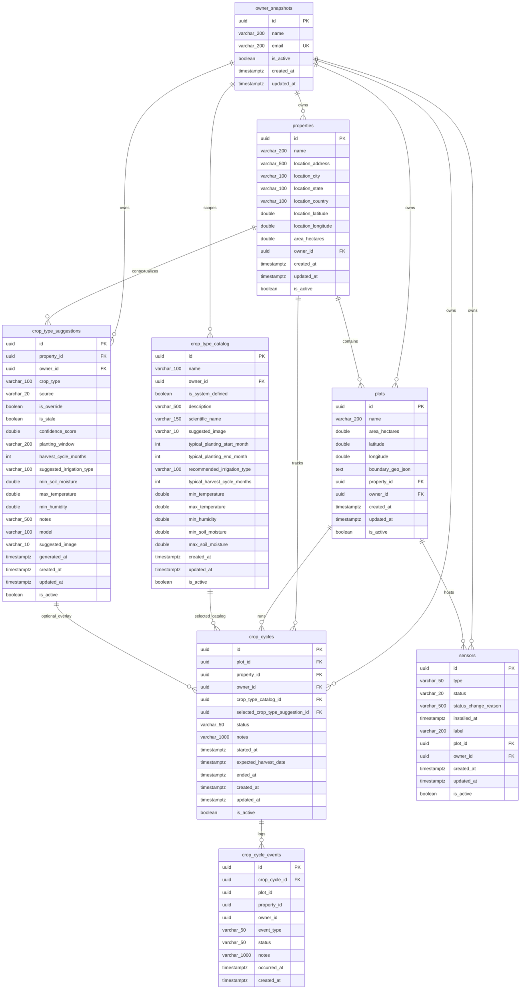

# Farm Service ER Diagram - Target Refactor Model

This document preserves the agreed end-state for the crop-cycle and tenant-scoped catalog refactor.

## Scope

- Target state after the crop-cycle refactor is fully completed
- Verified against implemented schema artifacts plus the agreed simplification plan for `plots`
- Implementation status on 2026-03-11:
  - Done: suggested image, tenant-scoped catalog, catalog-first reads, crop cycles, crop cycle events, property location blocking
  - Pending: plot simplification and dedicated frontend/options contract work

## Mermaid



## DBML

```dbml
Table owner_snapshots {
  id uuid [pk]
  name varchar(200) [not null]
  email varchar(200) [not null, unique]
  is_active boolean [not null, default: true]
  created_at timestamptz [not null]
  updated_at timestamptz
}

Table properties {
  id uuid [pk]
  name varchar(200) [not null]
  location_address varchar(500) [not null]
  location_city varchar(100) [not null]
  location_state varchar(100) [not null]
  location_country varchar(100) [not null]
  location_latitude double
  location_longitude double
  area_hectares double [not null]
  owner_id uuid [not null]
  created_at timestamptz [not null]
  updated_at timestamptz
  is_active boolean [not null, default: true]
}

Table crop_type_catalog {
  id uuid [pk]
  name varchar(100) [not null]
  owner_id uuid
  is_system_defined boolean [not null, default: true]
  description varchar(500)
  scientific_name varchar(150)
  suggested_image varchar(10)
  typical_planting_start_month int
  typical_planting_end_month int
  recommended_irrigation_type varchar(100)
  typical_harvest_cycle_months int
  min_temperature double
  max_temperature double
  min_humidity double
  min_soil_moisture double
  max_soil_moisture double
  created_at timestamptz [not null]
  updated_at timestamptz
  is_active boolean [not null, default: true]
}

Table crop_type_suggestions {
  id uuid [pk]
  property_id uuid [not null]
  owner_id uuid [not null]
  crop_type varchar(100) [not null]
  source varchar(20) [not null]
  is_override boolean [not null, default: false]
  is_stale boolean [not null, default: false]
  confidence_score double
  planting_window varchar(200)
  harvest_cycle_months int
  suggested_irrigation_type varchar(100)
  min_soil_moisture double
  max_temperature double
  min_humidity double
  notes varchar(500)
  model varchar(100)
  suggested_image varchar(10)
  generated_at timestamptz
  created_at timestamptz [not null]
  updated_at timestamptz
  is_active boolean [not null, default: true]
}

Table plots {
  id uuid [pk]
  name varchar(200) [not null]
  area_hectares double [not null]
  latitude double
  longitude double
  boundary_geo_json text
  property_id uuid [not null]
  owner_id uuid [not null]
  created_at timestamptz [not null]
  updated_at timestamptz
  is_active boolean [not null, default: true]
}

Table crop_cycles {
  id uuid [pk]
  plot_id uuid [not null]
  property_id uuid [not null]
  owner_id uuid [not null]
  crop_type_catalog_id uuid [not null]
  selected_crop_type_suggestion_id uuid
  status varchar(50) [not null]
  notes varchar(1000)
  started_at timestamptz [not null]
  expected_harvest_date timestamptz
  ended_at timestamptz
  created_at timestamptz [not null]
  updated_at timestamptz
  is_active boolean [not null, default: true]
}

Table crop_cycle_events {
  id uuid [pk]
  crop_cycle_id uuid [not null]
  plot_id uuid [not null]
  property_id uuid [not null]
  owner_id uuid [not null]
  event_type varchar(50) [not null]
  status varchar(50) [not null]
  notes varchar(1000)
  occurred_at timestamptz [not null]
  created_at timestamptz [not null]
}

Table sensors {
  id uuid [pk]
  type varchar(50) [not null]
  status varchar(20) [not null]
  status_change_reason varchar(500)
  installed_at timestamptz [not null]
  label varchar(200)
  plot_id uuid [not null]
  owner_id uuid [not null]
  created_at timestamptz [not null]
  updated_at timestamptz
  is_active boolean [not null, default: true]
}

Ref: properties.owner_id > owner_snapshots.id
Ref: crop_type_catalog.owner_id > owner_snapshots.id
Ref: crop_type_suggestions.owner_id > owner_snapshots.id
Ref: crop_type_suggestions.property_id > properties.id
Ref: plots.property_id > properties.id
Ref: plots.owner_id > owner_snapshots.id
Ref: crop_cycles.plot_id > plots.id
Ref: crop_cycles.property_id > properties.id
Ref: crop_cycles.owner_id > owner_snapshots.id
Ref: crop_cycles.crop_type_catalog_id > crop_type_catalog.id
Ref: crop_cycles.selected_crop_type_suggestion_id > crop_type_suggestions.id
Ref: crop_cycle_events.crop_cycle_id > crop_cycles.id
Ref: sensors.owner_id > owner_snapshots.id
Ref: sensors.plot_id > plots.id
```

## Notes

- `plots` is intentionally simplified to the physical footprint and ownership context of a field.
- Crop lifecycle data moves to `crop_cycles`.
- `crop_type_catalog.owner_id` is nullable: `NULL` means system-defined; a tenant UUID means producer-scoped catalog.
- `crop_cycle_events.plot_id`, `crop_cycle_events.property_id`, and `crop_cycle_events.owner_id` are denormalized snapshot keys for audit readability. The only required physical foreign key is `crop_cycle_id`.
- The current codebase has already implemented `crop_cycles` and `crop_cycle_events`, but plot simplification remains pending.
